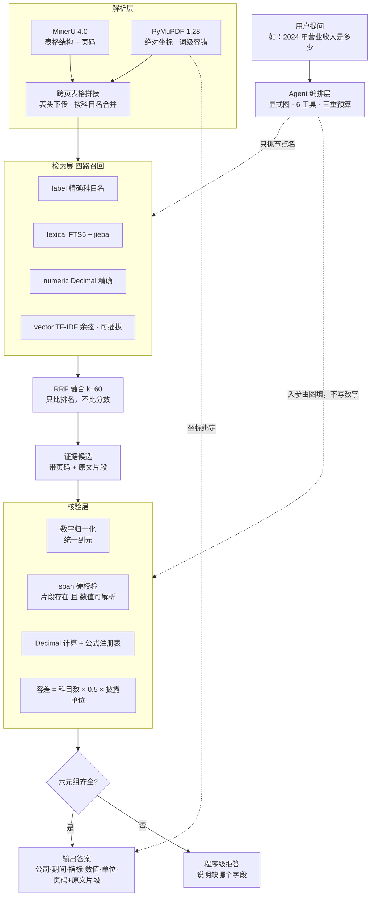

<div align="center">

# VeriFin

**每个数字都能点回原文页码的财报核验 Agent**

从上市公司年报 PDF 中检索证据，输出带页码与原文片段的答案，并自动核验财务勾稽关系。
**找不到证据就拒答 —— 不复述、不补全、不让模型自由发挥。**

</div>

<p align="center">
  
  
  
  
  
  
</p>

<p align="center">
  <a href="./docs/项目上下文速览-v1.0.md">快速接手</a> ·
  <a href="./docs/技术选型-v1.1.md">技术选型</a> ·
  <a href="./docs/技术问题留档.md">缺陷留档</a> ·
  <a href="#-路线图">路线图</a> ·
  <a href="#-许可证">许可证</a>
</p>

<details open>
<summary><b>📕 目录</b></summary>

- 💡 [VeriFin 是什么](#-verifin-是什么)
- 🎮 [快速开始](#-快速开始)
- 🔥 [最近更新](#-最近更新)
- 🌟 [核心特性](#-核心特性)
- 🔎 [系统架构](#-系统架构)
- 📁 [目录结构](#-目录结构)
- 🔧 [配置](#-配置)
- 🧪 [验证方式](#-验证方式)
- 📚 [文档索引](#-文档索引)
- 📜 [路线图](#-路线图)
- 🙌 [参与共建](#-参与共建)
- 📄 [许可证](#-许可证)

</details>

---

## 💡 VeriFin 是什么

问一个关于年报的问题 —— 「贵州茅台 2024 年营业收入是多少」「资产 = 负债 + 所有者权益是否平衡」。
VeriFin 从年报 PDF 里定位证据，给出答案，**每个数字都带六元组溯源**：

```
[公司, 期间, 指标, 数值, 单位, 来源页码 + 原文片段]
```

缺任一字段 → **程序级拒答**。

它不是「会聊天的财报助手」，而是**可追溯的核验工具**：

| 传统 RAG 问答 | VeriFin |
|---|---|
| 答案来自模型语言先验 | 数值只能来自 span 校验通过的原文 |
| 「不要编造」写在提示词里 | 「字符串在不在原文里」是一条可判定规则 |
| 数字错了没人知道 | 数字错了会被 span 校验直接拦下 |
| 尽量给一个答案 | 证据不全就拒答，并说明缺哪个字段 |
| 引用到文档块 | 引用到具体页码 + PDF 绝对坐标 + 原文片段 |

**目标场景**：年报数据核对、勾稽关系自检、投研与审计的底稿溯源。
**解决的痛点**：人工翻 300 页 PDF 找一行数字，且容易看错单位（万元 / 元）或漏加少数股东权益。

---

## 🎮 快速开始

### 📝 环境要求

- Python >= 3.11
- 解析层与检索层依赖较重，按需安装（`.[parse,retrieve]`）
- LLM：任意 OpenAI 兼容端点即可

> [!TIP]
> 本机 `pip` 无法解包 sdist 时，用 `scripts/bootstrap_env.sh`（内含 sdist 绕行方案），或直接 `.venv/bin/pip install -e .`。

### 🚀 三步跑通

```bash
# 1. 建虚拟环境并安装
python3 -m venv .venv
.venv/bin/pip install -e ".[parse,retrieve,dev]"

# 2. 配置凭证（.env 已被 .gitignore 排除，永不入库）
cp .env.example .env
# 编辑 .env，填写 LLM_BASE_URL / LLM_API_KEY / LLM_MODEL

# 3. 跑全链路演示：解析 → 跨页拼接 → 四路检索 → 坐标定位 → 导出原文高亮图
.venv/bin/python scripts/demo_evidence.py
```

实跑输出节选（茅台 2024 年报）：

```
  查询：2024年营业收入是多少
    各通道命中：{'label': 0, 'lexical': 2, 'numeric': 0, 'vector': 2}
    命中：p63  营业收入  = 170,899,152,276.34
    命中通道：lexical+vector
    坐标（PDF point）：(127.1, 316.1, 420.7, 326.6)

  查询：242,011,315,120.60
    各通道命中：{'label': 0, 'lexical': 0, 'numeric': 1, 'vector': 3}
    命中：p61  所有者权益（或股东权益）合计  = 242,011,315,120.60
    命中通道：numeric+vector
    坐标（PDF point）：(95.7, 135.2, 407.8, 159.4)

=== 四、导出高亮图（人工复核用）===
    p59 高亮 1 处 → data/parsed/evidence_p59.png
    p63 高亮 1 处 → data/parsed/evidence_p63.png
```

其他入口：

```bash
.venv/bin/python -m pytest                      # 189 项测试
.venv/bin/python scripts/demo_core.py           # 抽取 → span 校验 → 勾稽核验 → 拒答
.venv/bin/python scripts/demo_agent.py          # Agent 端到端（加 --llm 用 LLM 做调度）
.venv/bin/python scripts/parse_mineru_md.py     # MinerU 解析 + 恒等式自检
.venv/bin/python scripts/check_llm.py           # 探测端点能力（工具调用 / 结构化输出）
```

### 🖥️ Web 演示页

```bash
.venv/bin/python -m uvicorn web.server:app --port 8765
# 打开 http://127.0.0.1:8765
```

页面把上面那条链路摊开给人看，共六块：

| 区块 | 展示什么 |
|---|---|
| 提问与执行轨迹 | 每个阶段的状态灯都是程序判定：四路召回 → RRF 融合 → 证据选取 → span 校验 → 坐标定位 → 六元组 |
| 六元组与证据 | 六字段 + 原文片段 + **PDF 证据特写图**（坐标层裁剪放大，人工复核用） |
| 四路召回明细 | 每条候选命中了哪几路、各路名次、RRF 分 |
| 防幻觉演示台 | 同一条证据喂三次：真实值（采纳）/ 篡改值（拦截）/ 伪造片段（拦截） |
| 勾稽核验 | 资产 = 负债 + 所有者权益，本期与上期双列，给出差额与推导出的容差 |
| **Agent 编排** | 跑一次完整 Agent，逐步打印节点 / 工具 / 入参 / 来源（`llm` 还是 `policy`）/ 是否降级；可从轨迹库回放任一次历史运行 |

> [!NOTE]
> 前五块跑的是**确定性路径**，不经 LLM —— 它们要证明的正是「每个数字都有确定性来源」。
> 第六块（Agent）才引入调度，且调度器做的唯一一件事是**在合法后继里挑一个节点名**：
> 数值、算术、拒答判定永远走确定性代码。

---

## 🔥 最近更新

- **2026-09-19** Agent 编排落地（D3）：显式图 + 6 个工具 + 三重预算 + 执行轨迹入库。
  **LLM 只选节点、参数由图填** —— 让「LLM 不产生数字」这条红线在编排层也成立
- **2026-09-19** Web 演示页新增 Agent 编排区块：逐步轨迹 + 降级标记 + 历史运行回放
- **2026-09-19** 检索层落地：四路召回（label / lexical / numeric / vector）+ RRF(k=60) 融合；`Embedder` 做成可插拔协议，本地 `TfidfEmbedder` 兜底
- **2026-09-19** PyMuPDF 坐标层落地：词级容错匹配 + 同行垂直重叠校验 + 原文高亮 PNG 导出
- **2026-09-19** 跨页表格拼接：多种表格序列化统一处理，资产负债表跨页不再是孤岛
- **2026-09-19** 财务专用词典注入：修复 jieba 把「营业收入」切成「营业」+「收入」的静默降级
- **2026-09-18** MinerU 双路解析接入：`资产总计 = 负债合计 + 所有者权益合计` 实跑通过，差额 0.00

---

## 🌟 核心特性

### 🛡️ 让 LLM 无法撒谎

三条不可越过的红线：

| # | 红线 | 实现方式 |
|---|---|---|
| 1 | LLM 不产生任何数字 | 数值只能来自 span 校验通过的原文 |
| 2 | LLM 不做任何算术 | 算术全部走 `decimal.Decimal` + 公式注册表 |
| 3 | LLM 无权决定拒答与否 | 六元组缺字段即程序级拒答，模型没有否决权 |

> [!IMPORTANT]
> 「难点不是让 LLM 更聪明，而是让 LLM 无法撒谎。」
> 这三条是**程序约束**，不是提示词里的叮嘱 —— 违反时不会得到答案，会得到拒答。

### 🍱 三层防幻觉闸门

**第一层：数字归一化**（`verifin/normalize.py`）

embedding 会把 `12,345.67`、`12345.67`、`1.23亿元` 当成三个无关词串，所以数值必须先确定性归一化：
全角转半角 → 去千分位 → 数值与单位分离 → 统一到「元」。

**第二层：span 硬校验**（`verifin/span.py`）

模型报出数值时，**必须同时回吐它认为的原文片段**，程序执行字符串级校验。两道关卡缺一不可：

1. 片段必须能在原文中找到（含归一化容错）
2. **声称的数值必须能从该片段中解析出来**

只做第 1 层是不够的 —— 模型完全可以引用一段真实存在的原文，却报出一个错误的数字。第 1 层会放行，第 2 层不会。

**第三层：容差由披露单位推导**（`verifin/formulas.py`）

```
容差 = 参与科目数 × 0.5 × 报表披露单位
```

报表以万元披露时，每个科目有 ±0.5 万元的舍入误差。写死 `abs(diff) < 0.01` 会让所有恒等式误报。

### 🎯 核验结论分三级，不是二值

| 结论 | 含义 | 例子 |
|---|---|---|
| `PASS` | 恒等式成立，或派生量在容差内 | 资产 = 负债 + 权益 |
| `WARN` | 可疑但无法判定为错 | 同比变动 300%（可能是并购）、操作数缺失 |
| `FAIL` | 确定性的错误 | 恒等式不平衡 |

同比变动 **不是恒等式**，大幅变动可能来自并购重组，判成 `FAIL` 就是误报。而资产 ≠ 负债 + 权益，无论什么原因都说明数据有问题。

内置的勾稽核验覆盖两类：**资产负债表 / 利润表 / 现金流量表恒等式**（F1、F2a、F2b、F3a、F3b、F5），以及**派生量与启发式**（F4 毛利率、F6 同比变动）。每个恒等式自带「常见成因」与「常见漏项」线索，不平衡时直接给出核查方向。

### 🔍 四路召回，不是单靠向量

单靠向量检索找财务数字必然失败 —— 前文说过，embedding 不认识 `298,944,579,918.70` 这串数字。VeriFin 用四条独立通道并行召回，再用 RRF 只按排名融合：

| 通道 | 干什么 | 为什么不能没有 |
|---|---|---|
| `label` | 精确科目名匹配 | BM25 会让「负债合计」排在「非流动负债合计」后面 |
| `lexical` | FTS5 + jieba + 财务词典 | 处理自然语言提问，如「2024 年营收是多少」 |
| `numeric` | Decimal 精确比对 | 反查场景：给一个数，找出它是哪个科目 |
| `vector` | TF-IDF 余弦（可插拔） | 表达语义相近但字面不同的问法 |

> [!NOTE]
> 融合用 RRF（Reciprocal Rank Fusion）而非分数加权：四条通道的分数不可比，只比排名可以避免归一化带来的口径污染。

### 📐 坐标能落到 PDF 物理位置上

`verifin/geometry.py` 给出每个数字的 **PDF 绝对坐标（point）**，并能导出高亮图供人工复核。

这解决的是「张冠李戴」：标签匹配对了，却取到隔壁行的数值 —— 坐标层用**同行垂直重叠校验**（`same_row_verified`）兜住这一关，不在同一行就不返回坐标。

### 🤖 编排是一个显式图，不是一个黑盒循环

```
INTENT ──┬─→ SEARCH → EVIDENCE → VERIFY_SPAN → LOCATE → ANSWER
         ├─→ LIST_FORMULAS → COMPUTE ─────────────────→ ANSWER
         └─→ REFUSE（任何时刻都可直达）        ABORT（预算耗尽）
```

十个节点（其中 3 个是终态）、六个工具、一张邻接表。图是**声明式**的（`GRAPH` 字典就是图本身），
所以既能渲染出来给人看，也能被单测逐条校验（后继是否都存在、终态是否真的无后继）。

**谁在决定下一步** —— 这决定它算不算一个 Agent：

| 决策者 | 能决定什么 | 不能决定什么 |
|---|---|---|
| LLM（`LLMPlanner`） | 在**当前节点的合法后继**里挑一个节点名 | 编节点名（非法值被丢弃并记 `raw_choice`）、填任何工具参数 |
| 程序（`policy_decide`） | 确定性兜底：同样的状态永远得到同样的下一步 | — |

两条硬约束都由程序执行，LLM 无权绕过：

1. **工具入参由图从上一步状态里填**（`graph._fill_args`）。LLM 只挑节点名，
   所以它在理由里写多少个数字，也进不了 `claimed_value` —— 这是红线 #1 在编排层的落点。
2. **`ANSWER` 节点先查六元组是否齐全**，不齐就照样转 `REFUSE`。LLM 选了 `ANSWER` 也不算数。

**降级不掩盖**：LLM 没配、调用失败、返回非法值、预算用尽 —— 任何一种情况都会退到确定性策略，
并在结果里标 `source="policy"`。**这个字段是给消融实验读的**，
否则「LLM 调度没效果」这种结论可能只是因为它压根没被调用。

**预算按次运行计**（`max_steps=12` / `max_tool_calls=10` / `max_llm_calls=8`），
每次 `run()` 重置 —— 调度器会被多个问题复用，计数器若跨运行累积，第二个问题起就会静默降级。

**每一步都落库**：`data/index/agent_trace.db` 记录节点、工具、入参、返回值、来源与降级标记，
可逐步回放。正确性可复查，不靠日志猜。

---

## 🔎 系统架构



**一条数据都不会从 LLM 那条路出来**：LLM 只负责理解意图、选择节点、组织语言；
数值、算术、拒答判定全在上面三条确定性路径里。

---

## 📁 目录结构

```
VeriFin/
├── verifin/
│   ├── normalize.py      # 数字/文本归一化（stdlib，无第三方依赖）
│   ├── span.py           # span 硬校验 —— 防幻觉核心（stdlib）
│   ├── compute.py        # Decimal 计算原语（stdlib）
│   ├── formulas.py       # 勾稽公式注册表 + 容差推导（stdlib）
│   ├── tables.py         # 表格抽取 + 跨页拼接（HTML 表 / markdown 管道表 双路）
│   ├── geometry.py       # PyMuPDF 坐标层：容错定位 + 同行校验 + 高亮导出
│   ├── lexicon.py        # 财务专用词典（jieba 不认识会计科目，必须注入）
│   ├── retrieval.py      # 四路检索 + RRF 融合 + 可插拔 Embedder
│   ├── agent/            # Agent 编排层 —— 显式图，不依赖任何 Agent 框架
│   │   ├── graph.py      #   节点表 + 邻接表 + 预算三件套 + 参数由图填
│   │   ├── planner.py    #   LLM 选节点 + 确定性兜底（降级标 source="policy"）
│   │   ├── tools.py      #   6 个工具 + ToolRuntime 资源容器 + 科目名对齐表
│   │   └── trace.py      #   执行轨迹入库（SQLite），逐步可回放
│   ├── models.py         # Pydantic 数据模型 + JSON Schema
│   └── llm.py            # OpenAI 兼容客户端，带结构化输出降级
├── web/
│   ├── server.py         # 演示服务：确定性链路 + `/api/agent`（FastAPI）
│   └── index.html        # 演示页：轨迹 / 六元组 / 证据特写 / 防幻觉 / 勾稽 / Agent
├── scripts/
│   ├── demo_core.py      # 端到端：抽取 → span 校验 → 勾稽核验 → 拒答
│   ├── demo_evidence.py  # 全链路：解析 → 检索 → 坐标定位 → 高亮图
│   ├── demo_agent.py     # Agent：意图 → 选节点 → 调工具 → 六元组 / 拒答
│   ├── parse_mineru_md.py# MinerU 解析 + 恒等式自检
│   ├── bootstrap_env.sh  # 环境引导（含 pip sdist 绕行）
│   └── check_llm.py      # 端点能力探测
├── tests/                # 189 项测试
└── docs/                 # 选型 / 缺陷留档 / 接手入口
```

**一个刻意的设计**：`normalize` / `span` / `compute` / `formulas` 四个核心模块**只依赖 Python 标准库**。
核验规则可以脱离 LLM、脱离解析层单独测试 —— 即使模型服务或解析器不可用，判定逻辑依然可验证。

---

## 🔧 配置

`.env` 只需要三个变量，任何 OpenAI 兼容端点都可以：

```ini
LLM_BASE_URL=https://your-endpoint/v1
LLM_API_KEY=sk-...
LLM_MODEL=your-model-name
```

> [!CAUTION]
> **向量通道默认走本地 TF-IDF，不是真实 embedding。**
> 实测可用端点的 `/v1/embeddings` 全量 404、`/v1/models` 中 embedding 类模型计数为 0。
> 因此 `Embedder` 做成可插拔协议 —— 接入真实 embedding 只需替换一个实现，不需要改动检索层。

---

## 🧪 验证方式

正确性由测试保证，不由人工检查保证。

```bash
.venv/bin/python -m pytest
```

| 测试模块 | 数量 | 覆盖对象 |
|---|---|---|
| `test_formulas.py` | 36 | 勾稽公式、容差推导、三级结论 |
| `test_tables.py` | 32 | 双序列化解析、跨页拼接、数值列推导 |
| `test_agent.py` | 33 | 图结构合法性、路线分流、六元组装配、拒答、预算终止、降级标记、轨迹回放 |
| `test_normalize.py` | 27 | 单位换算、全角半角、千分位 |
| `test_geometry.py` | 21 | 容错匹配、折行标签、同行校验、页码边界 |
| `test_span.py` | 20 | span 硬校验两层关卡 |
| `test_retrieval.py` | 20 | 词典、四路召回、RRF、端到端 |

> [!TIP]
> `normalize` / `span` / `compute` / `formulas` 四个核心模块**只依赖 Python 标准库**。
> 核验规则可以脱离 LLM、脱离解析层单独测试 —— 即使模型服务或解析器不可用，判定逻辑依然可验证。
>
> `test_agent.py` 里**没有一次真实 LLM 调用，也没有真实 PDF**：
> 调度器、工具资源、PDF 句柄全部是可注入的假实现。
> 这不是为了跑得快，而是因为「LLM 不参与数值 / 不参与拒答判定」这两条红线
> **只有在一个没有 LLM 的环境里才能被证明。**

---

## 📚 文档索引

| 文档 | 内容 |
|---|---|
| `docs/项目上下文速览-v1.0.md` | 新会话接手入口：模块清单、已知缺陷、下一步 |
| `docs/技术选型-v1.1.md` | 选型的唯一权威来源，含每层候选对比与实测依据 |
| `docs/技术问题留档.md` | P-001 ~ P-015：跨页表格、附注列、端点无 embedding、科目名口径、编排层红线冲突等的设计级缺陷归档（含每条的原方案 / 短板 / 实测证据 / 解决方案 / **残留限制**） |
| `docs/开源底座选型与二次开发方案-v0.1.md` | 开源平台调研：为何不整体 fork RAGFlow / Dify / QAnything |
| `docs/财报核验Agent-方案设计-v0.1.md` | 原始方案设计 |

---

## 📜 路线图

| 阶段 | 工作 | 状态 |
|---|---|---|
| D0 | 核心核验层：六元组 / span 校验 / Decimal / 公式注册表 | ✅ 已完成 |
| D1 | MinerU 解析层：年报 → 带页码的结构化块 | ✅ 已完成 |
| D2 | 四路检索 + RRF 融合 | ✅ 已完成 |
| D2b | PyMuPDF 坐标层 + 原文高亮导出 | ✅ 已完成 |
| D3 | Agent 编排：显式图 + 6 个工具 + 预算控制 + 执行轨迹入库 | ✅ 已完成 |
| D4 | 评测集：FinanceBench 开放集 + 自建 A 股集（含拒答题） | 🔜 进行中 |
| D5 | V0 / V1 / V2 三版 + 消融实验 | ⬜ 待开始 |
| D6 | 失败案例归档与演示 | ⬜ 待开始 |

评测指标：单值核验准确率 / 勾稽核验准确率 / 综合核验准确率 / **拒答率（单独报）** / 证据召回准确率 / 引用支持度 / 端到端耗时 P50·P95 / 单次查询成本。

> [!NOTE]
> 预期现象：V1 → V2 准确率上升，**且拒答率显著上升**。
> 拒答率上升不是缺点 —— 那是护栏在生效的证据。

**D3 给 D4/D5 留下的三条纪律**（都是编排层实跑暴露出来的）：

1. **消融要看轨迹里的 `source` 字段**，统计「LLM 真实参与了多少步」。
   调度器被多个问题复用，预算若不按运行重置，第二个问题起会静默降级 ——
   那会让消融得出「LLM 调度没用」的错误结论。
2. **`ABORT` 与 `REFUSE` 分开统计**。前者是「没算完」，后者是「证据不足」。
   混在一起会把规划器的缺陷记成召回失败。
3. **并发评测前先把 planner 改成 per-request 实例**，否则并发请求互相偷预算。

---

## 🙌 参与共建

分支只有两条：

| 分支 | 用途 |
|---|---|
| `main` | 始终处于「测试全绿 + 可运行」状态 |
| `feat/<主题>` | 单个主题一条分支，合回 `main` 后删除 |

提交前缀：`feat:` / `fix:`（需写明复现条件与根因）/ `rename:` / `refactor:` / `docs:` / `chore:`。

入库红线：

1. `.env` 永不入库；`.env.example` 只含占位符
2. `data/pdfs/*.pdf`、`data/parsed/`、`data/index/`、`*.db` 不入库（体积大且可复现）
3. `pytest` 全绿才能合回 `main`
4. 遇到「原方案有短板 → 换方法解决」或「机制静默失效」的问题，写进 `docs/技术问题留档.md`；依赖安装、配置缺失、纯手误类问题不进留档

---

## 已知限制

1. **`value_matches_span` 不区分数字的语义角色**。片段含日期时（如 `2023-12-31`），年份 `2023` 会被当作一个金额。这是刻意接受的取舍 —— 真正的语义归属由表格结构层负责，此处只做一道廉价的合理性闸门，计数「引用支持度」时应作为必要条件而非充分条件。
2. **`suspect_operands` 只能从现有操作数的量级定位矛盾字段**。若出错的项目根本没被抽取（如漏了少数股东权益），它无法定位，只能靠公式自带的「常见漏项」线索。这是启发式排序，不是归因结论。
3. **向量通道用本地 TF-IDF**，语义泛化弱于真实 embedding 模型（原因见上文 > [!CAUTION]）。
4. **坐标层依赖 PDF 内嵌文本层**。扫描版（图片型）PDF 没有文本层，需要先接 OCR 通道。
5. **跨页表格拼接依赖「续页不带表头」这一约定**。若发行人重复打印了表头，会把续页误判为新表。
6. **支持范围**：单份中文年报 PDF 的核验问答。不支持实时行情、股价、新闻，以及多公司批量对比。
7. **编排层的兜底策略不会真正重试检索**。「换关键词重搜」只在 LLM 调度时发生；
   LLM 全程不可用时，第一次没召回到就必然拒答。这是刻意选择 ——
   宁可漏答，也不要因重试把预算烧光后给出语焉不详的 `ABORT`。
8. **Web 服务内共享一个调度器**，并发请求会互相消耗 LLM 预算（不会产生错误答案，只是更容易降级）。
   单用户演示无影响；并发评测前需改为 per-request 实例。
9. **没有现成的可观测性生态**。编排层未引入任何 Agent 框架，
   因此也没有 Logfire / OTel 那类追踪，`trace.py` 的 SQLite 轨迹是唯一手段。
10. **「不用 Pydantic AI」这一条是范式判断，不是实测否决** —— 本项目从未安装过它。
    如实列出，避免被追问时说不清依据（完整论证见 `docs/技术问题留档.md` P-013）。

---

## 📄 许可证

[Apache License 2.0](./LICENSE)。

评估数据集遵循各自原始许可证：FinanceBench 为 CC-BY-NC-4.0（**非商用**），FinQA / TAT-QA 为 CC-BY 4.0。评测报告会写明各数据集的许可与查询日期。
